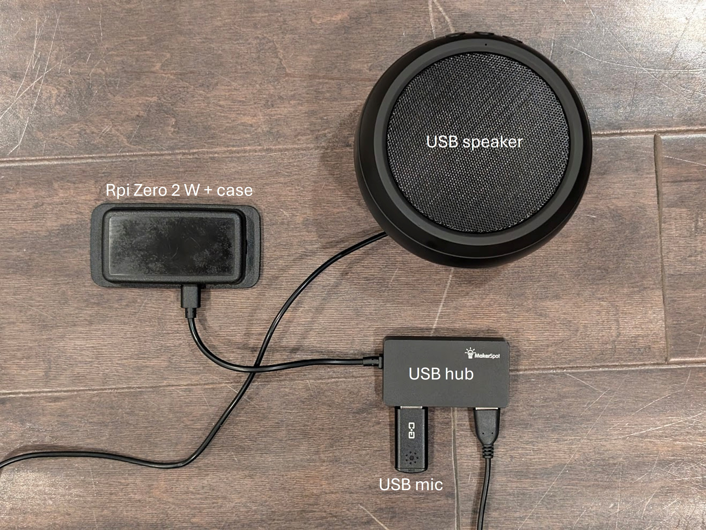

# 👶 SMOO - Smart Baby White Noise Machine

An adaptive white noise system that automatically adjusts sound levels in response to baby crying sounds, using machine learning for cry detection.


## ⚠️ IMPORTANT SAFETY DISCLAIMER

**THIS IS NOT A MEDICAL DEVICE AND IS NOT A SUBSTITUTE FOR PARENTAL SUPERVISION.**

- This project is for supplemental use only and should never replace proper baby monitoring
- Audio detection may have false positives or false negatives
- Always follow safe sleep guidelines from your pediatrician
- Test the system thoroughly before relying on it
- Ensure volume levels are safe for infant hearing

## Features

- **Adaptive Sound Levels**: Automatically adjusts white noise intensity (0-4) based on baby's crying
- **Machine Learning Detection**: Uses Google's YAMNet model for accurate cry detection
- **Web Interface**: Modern, mobile-friendly control panel
- **Real-time Monitoring**: Live status updates and manual level control
- **Cross-platform**: Works on Windows, Linux, and Raspberry Pi
- **Configurable**: Adjust detection sensitivity, timing, and volume levels

## Example on Raspberry Pi Zero 2 W
This is my setup with a RPi zero 2 w, a USB hub, USB microphone, and simple USB speaker
<br>


## How It Works

1. **Baseline sound**: A baseline white noise sound plays when you hit start
2. **Listens**: Microphone continuously monitors for crying sounds
3. **Detects**: YAMNet AI model analyzes audio to identify crying
4. **Responds**: Automatically increases white noise level when crying is detected
5. **Adapts**: Gradually decreases level when baby calms down

## Hardware Requirements

### Minimum Setup
- **Computer**: Raspberry Pi Zero 2 W or better (or any PC with Python support)
- **Microphone**: USB or 3.5mm microphone for cry detection
- **Speaker**: Connected speaker or audio output device
- **OS**: Linux (Raspberry Pi OS), Windows

### Recommended for Raspberry Pi
- Raspberry Pi 3B+ or 4 (for better performance)
- Quality USB microphone with noise cancellation
- Powered speaker with good low-frequency response

## Installation

### Prerequisites

```bash
# Update system (Raspberry Pi/Linux)
sudo apt-get update
sudo apt-get upgrade

# Install system dependencies
sudo apt-get install python3-pip python3-dev portaudio19-dev

# For Linux: Install ALSA utilities
sudo apt-get install libasound2-dev
```

### Python Dependencies

**For Raspberry Pi:**
```bash
pip3 install -r requirements-pi.txt
```

**For Windows:**
```bash
pip install -r requirements-windows.txt
```

**For Linux Desktop:**
```bash
pip3 install -r requirements-linux.txt
```

### Manual Installation if not using requirements-*.txt

```bash
# Core dependencies
pip3 install pyaudio numpy scipy resampy flask flask-cors

# For Raspberry Pi (lighter weight)
pip3 install tflite-runtime

# For Windows/Linux Desktop
pip3 install tensorflow

# Platform-specific
# Windows only:
pip install pycaw comtypes

# Linux only:
pip install pyalsaaudio
```

## Quick Start

1. **Clone the repository:**
```bash
git clone https://github.com/prash-p/smoo-baby-white-noise.git
cd smoo-baby-white-noise
```

2. **Verify audio files exist:**
```bash
ls sounds/
# Should see: snoo - level 0.wav, snoo - level 1.wav, etc.
```

3. **Verify YAMNet model exists:**
```bash
ls yamnet*
# Should see: yamnet.tflite, yamnet_class_map.csv
```

4. **Test audio devices:**
```bash
python3 -c "import pyaudio; p = pyaudio.PyAudio(); print('Input devices:', p.get_device_count())"
```

5. **Start the web server:**
```bash
python3 app.py
```

6. **Open web interface:**
```
http://localhost:5000
```
Or from another device on your network:
```
http://YOUR_PI_IP_ADDRESS:5000
```

## Configuration

Edit the `CONFIG` dictionary in your audio module to customize behavior:

### Detection Settings
```python
"yamnet_min_confidence": 0.2,    # Minimum confidence for YAMNet (0.0-1.0)
"fft_min_freq": 200,             # Minimum frequency for cry detection (Hz)
"fft_max_freq": 1000,            # Maximum frequency for cry detection (Hz)
"power_threshold": 0.1,          # Sensitivity for FFT cry detection (0.0-1.0)
```

### Timing Settings
```python
"level_down_time": 60,           # Seconds of quiet before reducing level
"level_up_time": 5,              # Minimum seconds between level increases
```

### Volume Settings
```python
"volume_levels": {
    0: 95,  # Level 0: 95% system volume
    1: 97,  # Level 1: 97% system volume
    2: 98,  # Level 2: 98% system volume
    3: 99,  # Level 3: 99% system volume
    4: 100   # Level 4: 100% system volume
}
```

**⚠️ Volume Safety:** Adjust these values based on your speaker system and proximity to baby. High volumes can damage hearing.


## Web Interface

The web interface provides:

- **Status Display**: Real-time system status and current level
- **Start/Stop Controls**: Easy system control
- **Level Override**: Manually set sound level (0-4)
- **Settings Editor**: Adjust detection thresholds and timing on-the-fly


## Troubleshooting

### Audio Stuttering
- **Reduce chunk sizes** if CPU is struggling (see Performance Optimization)
- **Close other applications** using audio
- **Use a powered USB hub** for USB microphones on Raspberry Pi

### No Sound Detected
- Check microphone connection: `arecord -l` (Linux) or check Device Manager (Windows)
- Verify microphone permissions
- Test microphone: `arecord -d 5 test.wav` then `aplay test.wav`

### Volume Control Not Working
- **Linux**: Ensure ALSA mixer is available: `amixer scontrols`
- **Windows**: Check that pycaw is installed correctly
- Some systems may require different mixer controls

### "Module not found" Errors
- Verify all dependencies are installed: `pip3 list`
- Check you're using the correct Python version: `python3 --version`
- Try reinstalling PyAudio: `pip3 install --upgrade pyaudio`

### Web Interface Won't Load
- Check Flask is running: Look for "Running on http://0.0.0.0:5000"
- Verify firewall allows port 5000
- Try accessing from Pi itself first: `http://localhost:5000`


## Detection Methods

### YAMNet (Default)
- **Pros**: More accurate, recognizes various cry types, less false positives
- **Cons**: Higher CPU usage, requires TensorFlow Lite

### FFT (Alternative)
- **Pros**: Lower CPU usage, no ML model needed, faster response
- **Cons**: More false positives, frequency-based only

To switch methods, change the mode in `_monitor_loop()`.

## About the Audio Files

The included audio files use "snoo" in their naming as a reference to white noise machines. You can:

1. **Use the included files** (if you have them)
2. **Generate your own** white noise files at increasing volumes
3. **Record custom sounds** (white noise, pink noise, nature sounds, etc.)

Files should be:
- WAV format, 16-bit, mono or stereo
- Named: `snoo - level 0.wav` through `snoo - level 4.wav` or if you want to use different names make sure the code in `main.py` is changed to point to the correct filenames
- Located in the `sounds/` directory

## License

This project is licensed under the MIT License

## 🤝 Contributing

Contributions are welcome! Please feel free to submit a Pull Request. For major changes, please open an issue first to discuss what you would like to change.

---
